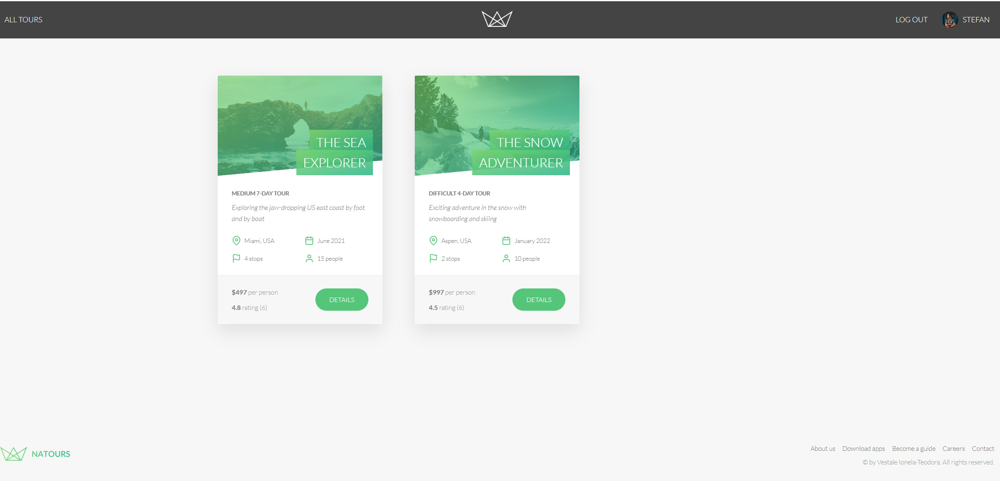

# Natours Vest App

## Description

Natours Vest App is a server-side rendered web application designed to sell touristic tours. The app allows users to browse and book various tours, providing a seamless experience for adventure seekers.

## Features

- Browse and search for touristic tours
- Book tours online with secure payment processing
- Secure authentication and user management
- User reviews and ratings
- Manage tour bookings
- Update user profiles and passwords

## Technologies Used

- **Node.js** (Server-side JavaScript runtime)
- **Express.js** (Web framework for Node.js)
- **MongoDB** (NoSQL database for data storage)
- **Mongoose** (MongoDB object modeling for Node.js)
- **Pug** (Template engine for server-side rendering)
- **JWT Authentication** (User authentication and security)
- **Stripe** (Online payment by card)

## Demo

### Main Tours Page


This is the homepage where users can browse available tours and see featured options.

### Tour Page - Description


Displays detailed information about a selected tour, including itinerary, highlights, and pricing.

### Tour Page - Map


Shows the tour route on a map, giving users a visual representation of the journey.

### Tour Page - Reviews & Buy Section


Includes user reviews, ratings, and a section to book the tour.

### Tour Page - Stripe Payment Page


Secure payment processing through Stripe for booking a tour.

### User Account Page


The user’s account dashboard for managing personal details and settings.

### User Bookings



Displays a list of booked tours with details.

## Installation

### Prerequisites

Make sure you have the following installed on your system:

- Node.js
- MongoDB

### Steps

1. Clone the repository:

   ```sh
   git clone https://github.com/Teodora3120/Natours-Web-App.git
   ```

2. Install dependencies:

   ```sh
   npm install
   ```

3. Set up environment variables:
   Create a `config.env` file and add the necessary configurations such as:

   ```sh
    NODE_ENV=development
    ADDRESS=127.0.0.1
    PORT=3000
    DATABASE=
    DB_USERNAME=
    DB_PASSWORD=

    JWT_SECRET=
    JWT_EXPIRES_IN=30d
    JWT_COOKIE_EXPIRES_IN=30

    EMAIL_USERNAME=
    EMAIL_PASSWORD=
    EMAIL_HOST=
    EMAIL_PORT=

    EMAIL_FROM=

    SENDGRID_USERNAME=
    SENDGRID_PASSWORD=

    STRIPE_SECRET_KEY=
   ```

4. Start the application:

   ```sh
   npm run start:dev
   ```

5. Open the application in your browser:
   ```sh
   http://127.0.0.1:3000
   ```

## API Endpoints

### Users

- `POST /api/v1/users/signup` - Create a new user account
- `POST /api/v1/users/login` - User login
- `GET /api/v1/users/me` - Get logged-in user details
- `PATCH /api/v1/users/updateMe` - Update user profile
- `PATCH /api/v1/users/updatePassword` - Update password
- `DELETE /api/v1/users/deleteMe` - Delete user account
- `GET /api/v1/users` - Get all users (admin only)
- `GET /api/v1/users/:id` - Get user by ID (admin only)
- `DELETE /api/v1/users/:id` - Delete a user (admin only)
- `PATCH /api/v1/users/:id` - Update a user (admin only)

### Tours

- `GET /api/v1/tours` - Get all tours
- `GET /api/v1/tours/:id` - Get a single tour
- `POST /api/v1/tours` - Create a new tour (admin only)
- `PATCH /api/v1/tours/:id` - Update tour details (admin only)
- `DELETE /api/v1/tours/:id` - Delete a tour (admin only)
- `GET /api/v1/tours/top-5-cheap` - Get top 5 cheapest tours
- `GET /api/v1/tours/tour-stats` - Get tour statistics
- `GET /api/v1/tours/monthly-plan/:year` - Get monthly plan
- `GET /api/v1/tours/tours-within/:distance/center/:latlng/unit/:unit` - Get tours within a certain distance
- `GET /api/v1/tours/distances/:latlng/unit/:unit` - Get distances to all tours from a point

### Reviews

- `POST /api/v1/reviews/:tourId` - Create a review for a tour
- `GET /api/v1/reviews` - Get all reviews
- `GET /api/v1/reviews/:id` - Get a single review
- `PATCH /api/v1/reviews/:id` - Update a review
- `DELETE /api/v1/reviews/:id` - Delete a review
- `GET /api/v1/tours/:tourId/reviews` - Get all reviews for a specific tour

### Bookings

- `GET /api/v1/bookings/checkout-session/:tourId` - Get checkout session for Stripe payments
- `POST /api/v1/bookings` - Create a new booking
- `PATCH /api/v1/bookings/:id` - Update booking (admin only)
- `GET /api/v1/bookings` - Get all bookings
- `DELETE /api/v1/bookings/:id` - Delete a booking (admin only)

## License

This project is licensed under the MIT License.
